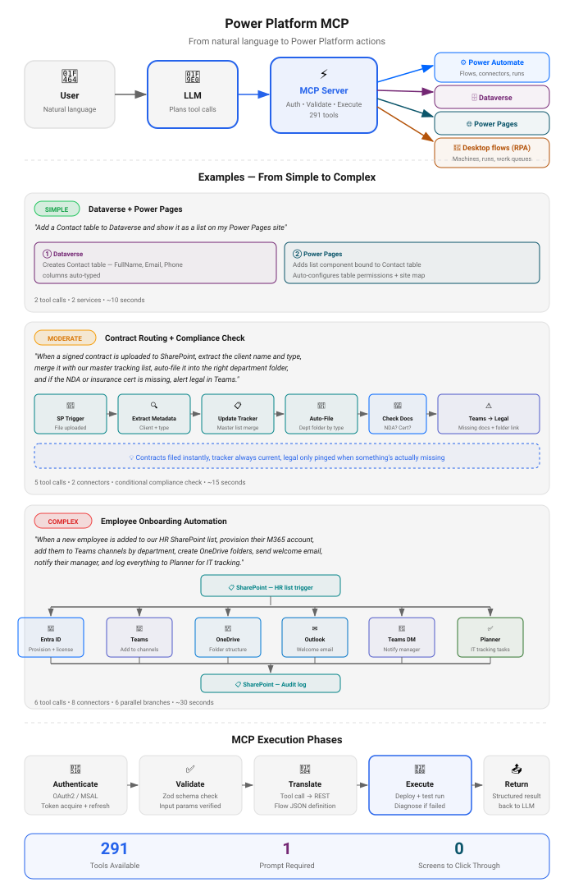

# Power Platform MCP Server

[](https://www.npmjs.com/package/powerautomate-mcp) [](https://www.npmjs.com/package/powerautomate-mcp)

**Docs:** **Overview** · [Installation & Upgrading](https://github.com/rcb0727/powerplatform-mcp-docs/blob/main/INSTALL.md) · [Changelog](https://github.com/rcb0727/powerplatform-mcp-docs/blob/main/CHANGELOG.md) · [Report an issue](https://github.com/rcb0727/powerplatform-mcp-docs/issues)

An MCP (Model Context Protocol) server for Microsoft Power Platform — **291 tools** spanning Power Automate flows, canvas app authoring, model-driven apps, SharePoint, Excel, Dataverse/Dynamics 365, Power Pages, Copilot Studio, and tenant administration. Build, run, diagnose, and govern automations in natural language.


> **How this became a Power Platform server.** It started as a Power Automate
> MCP — cloud flows, and not much else. What broadened it was other people:
> issues filed by users who needed Dataverse and DLP tooling, a discussion
> thread that turned into the connections work, a reported admin-API breakage
> that led to the whole governance surface, and a lot of troubleshooting
> against real tenants where the interesting bugs only show up. Power Apps,
> Power Pages, desktop flows, and work queues each arrived because someone
> asked or something broke. The npm package is still `powerautomate-mcp` —
> renaming it would break every existing install — but the scope is the
> platform now.

Works with any MCP-compatible AI client: **Claude Desktop**, **Claude Code**, **VS Code Copilot**, **Cursor**, **Google Gemini CLI**, and more.

## Documentation Map

| Page | What you'll find |
|------|------------------|
| **README** (this page) | [Features](#features) · [Quick Start](#quick-start) · [App Registration](#microsoft-entra-app-registration) · [CLI Reference](#cli-reference) · [How It Works](#how-it-works) · [All 290 Tools](#available-tools-290-total) · [Security](#security) · [Architecture](#architecture) |
| [Installation Guide](https://github.com/rcb0727/powerplatform-mcp-docs/blob/main/INSTALL.md) | [Choose your path](https://github.com/rcb0727/powerplatform-mcp-docs/blob/main/INSTALL.md#choose-your-path) · [Easy Path](https://github.com/rcb0727/powerplatform-mcp-docs/blob/main/INSTALL.md#easy-path-3-steps) · [Fast Path](https://github.com/rcb0727/powerplatform-mcp-docs/blob/main/INSTALL.md#fast-path-developers) · [Connect your AI app](https://github.com/rcb0727/powerplatform-mcp-docs/blob/main/INSTALL.md#connecting-your-ai-app) · [**Updating**](https://github.com/rcb0727/powerplatform-mcp-docs/blob/main/INSTALL.md#updating) · [Troubleshooting](https://github.com/rcb0727/powerplatform-mcp-docs/blob/main/INSTALL.md#troubleshooting) · [Glossary](https://github.com/rcb0727/powerplatform-mcp-docs/blob/main/INSTALL.md#glossary) · [Admin & enterprise](https://github.com/rcb0727/powerplatform-mcp-docs/blob/main/INSTALL.md#admin--enterprise-setup) |
| [Changelog](https://github.com/rcb0727/powerplatform-mcp-docs/blob/main/CHANGELOG.md) | Release history with per-version upgrade notes |
| [Privacy Policy](https://github.com/rcb0727/powerplatform-mcp-docs/blob/main/PRIVACY.md) | What runs locally, what talks to Microsoft, what we collect (nothing) |
| [Issues](https://github.com/rcb0727/powerplatform-mcp-docs/issues) | Bug reports and feature requests — every one gets read |

## Features

**291 tools, 25 groups — everything at a glance** (full list with descriptions: [Available Tools](#available-tools-290-total)):

<!-- TOOLS-GRID:BEGIN — generated by `npm run docs:tools`, do not edit by hand -->
| | | |
|---|---|---|
| **Setup & Authentication** (1) | **Core Flow Operations** (15) | **Testing & Debugging** (10) |
| **Planning & Help** (5) | **Connections & Custom Connectors** (15) | **Approvals** (3) |
| **Dataverse CRUD** (7) | **Dataverse Depth (queries, metadata, schema, bulk)** (11) | **SharePoint** (11) |
| **Excel (OneDrive)** (2) | **Power Apps** (12) | **Canvas App Authoring (Preview)** (13) |
| **Model-driven Apps** (13) | **Power Apps Administration** (4) | **Power Pages — Site Configuration** (9) |
| **Power Pages — Site Management** (36) | **Power Pages — PAC CLI** (8) | **Environment Administration** (11) |
| **DLP Policies** (6) | **Solutions ALM** (10) | **Managed Environments & Capacity** (6) |
| **Desktop Flows / RPA** (13) | **Work Queues (RPA orchestration)** (8) | **Billing & AI Builder** (3) |
| **Copilot Studio Agents** (59) |  |  |
<!-- TOOLS-GRID:END -->


Beyond the tool count:

- **Natural-language flow building** — describe the automation; `plan_flow` gathers the specifics, `build_flow` creates it (even before its connections are configured), and pre-flight validation scores it against best practices (0–100)
- **Real diagnosis, not error dumps** — failed runs are drilled to the failing step with the actual API error and a proposed fix
- **Complete model-driven app lifecycle** — create AppModules, add or remove components, validate, publish, and manage security-role access through documented Dataverse operations
- **Canvas source authoring (preview)** — create and edit supported `.pa.yaml` source, discover live controls/APIs/data sources, synchronize from Studio, and compile back through Microsoft's official Canvas Authoring MCP server
- **Power Pages from content to hosting** — edit Dataverse configuration, provision and poll websites, manage domains/certificates/WAF/security, and run supported `pac pages` deployment workflows
- **Real Solution ALM** — asynchronous solution export/import, component add/remove, clone, and publish-all operations use documented Dataverse actions instead of placeholders
- **Sign in from the chat** — the `sign_in` tool completes Microsoft device-code auth without a terminal; every action runs under your own work account
- **Everything annotated** — all 291 tools declare read-only/destructive hints, so AI hosts can apply the right guardrails
- **Cross-platform** — Windows, macOS, and Linux

## Install as a Claude Code plugin

If you use Claude Code, one command installs the server and ten guided skills
(setup, build-flow, debug-flow, manage-connections, desktop-flows, work-queues,
power-pages, dataverse, govern-tenant, report-issue):

```bash
/plugin marketplace add rcb0727/powerplatform-mcp-docs
/plugin install powerautomate-mcp@powerautomate-mcp
```

The plugin runs the server via `npx`, so there is nothing else to install. You
still run `powerautomate-mcp --setup` once to sign in — or use the in-chat
`sign_in` tool if you'd rather not open a terminal.

## Quick Start

Three commands — run them in a terminal:

```bash
npm install -g powerautomate-mcp   # 1. install
powerautomate-mcp --setup          # 2. sign in + connect your AI app
powerautomate-mcp --doctor         # 3. confirm everything works
```

The `--setup` wizard does it all: lets you choose a least-privilege permission set, creates the Entra app registration (or takes one you provide), signs you in, handles admin consent, picks your environment, **and wires the server into your AI app for you** — no hand-editing JSON. Then restart your app and ask it to build a flow.

**Not very technical?** Follow the step-by-step **[Easy Path](https://github.com/rcb0727/powerplatform-mcp-docs/blob/main/INSTALL.md#easy-path-3-steps)** with checkpoints.

| Want to… | Do this |
|----------|---------|
| Connect a specific app during setup | `powerautomate-mcp --setup --client claude` |
| Connect an app later (or a second one) | `powerautomate-mcp --client cursor` |
| Skip the global install | `npx -y powerautomate-mcp@latest --setup` (add `--npx` so your app uses npx too) |
| Configure your app by hand | [Manual client configs](https://github.com/rcb0727/powerplatform-mcp-docs/blob/main/INSTALL.md#connect-your-ai-app-manually) |

Supported apps: **Claude Desktop**, **Claude Code**, **Cursor**, **VS Code (Copilot)**, **Gemini CLI**, **Windsurf**, **ChatGPT** (via `--http`).

---

## Microsoft Entra App Registration

The setup wizard (`--setup`) detects your situation and only asks when it can't know: it looks for an existing setup, your organization's `org.json`, or an app visible through an already-signed-in Azure CLI — and if nothing is found, asks exactly one question: **paste your Client ID, or press Enter to create a new app registration**. Creating (the IT/first-person path) signs into Azure, registers the app with only the permissions you pick, and grants org-wide admin consent when your account is allowed to.

> **New tenants work too** (v0.13.0+): if your tenant has never used Power Platform, setup creates the missing first-party service principals and resolves the permission ids your tenant actually publishes — the old `AADSTS650052` / `AADSTS65006` sign-in failures repair themselves on a re-run of `--setup`.

### Who Needs to Do What?

| Role | Action |
|------|--------|
| IT / first person at the org | Run `--setup`, press **Enter** to create the app, then `--emit-org-config` to hand the rollout to MDM |
| Someone with a Client ID from IT | Run `--setup`, paste it — it's verified against Microsoft on the spot |
| Everyone else (org already deployed) | Nothing — with the org file on the machine, the first in-chat `sign_in` is the whole onboarding |

> **Rolling out to a team?** See [Mass deployment](INSTALL.md#mass-deployment-intune--gpo--jamf) — IT sets up once, pushes `org.json` machine-wide, and users never see a wizard. `PA_MCP_CLIENT_ID` as an environment variable also works for host-managed installs.

### Admin Consent

Consent is verified by doing, not asked about: the wizard attempts sign-in, and only if Microsoft reports the app isn't approved (AADSTS65001) does the approval link appear. On the create path, tenant-wide consent is granted automatically when the signed-in Azure CLI account holds an admin role. Any of these Entra ID roles can approve: **Global Administrator**, **Application Administrator**, **Cloud Application Administrator**, or **Privileged Role Administrator**. If you don't have one of these roles, share the URL with your admin:

```
https://login.microsoftonline.com/{tenant-id}/adminconsent?client_id=YOUR_CLIENT_ID
```

After an administrator changes an existing app's Power Platform API consent, call
`sign_in` with `{"resource":"power_platform_api","forceRefresh":true}` to request
a fresh token for that audience without clearing other cached tokens. The default
no-argument check only checks Power Automate (Flow), not Copilot Studio. The
resource-specific result reports known Copilot permission membership, not proven
API access: refreshing cannot add missing consent or user roles. If Microsoft
requires sign-in again, complete the returned device code and call `sign_in` again.

### Manual Setup (Optional)

If you prefer to create the app registration manually:

1. Go to [Azure Portal](https://portal.azure.com) > **Microsoft Entra ID** > **App registrations** > **New registration**

2. Configure basic settings:
   - **Name**: `Power Automate MCP`
   - **Supported account types**: Accounts in any organizational directory (multi-tenant)
   - **Redirect URI**: Select "Public client/native" and enter:
     ```
     https://login.microsoftonline.com/common/oauth2/nativeclient
     ```

3. After creation, go to **Authentication** and enable:
   - **Allow public client flows**: Yes

4. Go to **API permissions** > **Add a permission** and add only the permissions for the tool surfaces you want to enable. The setup wizard offers presets for **All tool surfaces**, **Power Automate only**, **Power Automate + connectors**, **Dataverse**, **Power Pages**, and **Custom**.

   | API | Permission | Type | Used For |
   |-----|------------|------|----------|
   | Power Automate (Flow Service) | `Flows.Read.All` | Delegated | Read flows |
   | Power Automate (Flow Service) | `Flows.Manage.All` | Delegated | Create/update/delete flows |
   | Power Automate (Flow Service) | `Activity.Read.All` | Delegated | Flow run history |
   | Power Automate (Flow Service) | `Approvals.Manage.All` | Delegated | Approval management |
   | Microsoft Graph | `User.Read`, `Sites.ReadWrite.All`, `Files.ReadWrite.All` | Delegated | Optional: SharePoint, OneDrive, and Excel helpers |
   | PowerApps Service | `User` | Delegated | Optional: connections, connector metadata, custom connectors, and Power Apps maker APIs |
   | BAP Admin API | `user_impersonation` | Delegated | Optional: admin tools, Dataverse URL discovery, and Power Pages configuration |
   | Dynamics CRM | `user_impersonation` | Delegated | Optional: Dataverse table/row CRUD and Power Pages configuration |
   | Power Platform API | `ResourceQuery.Resources.Read`, `CopilotStudio.Copilots.Invoke`, `CopilotStudio.MakerOperations.Read`, `CopilotStudio.MakerOperations.ReadWrite`, `CopilotStudio.AdminActions.Invoke`; `PowerPages.Websites.Read` and `PowerPages.Websites.Write` when selected | Delegated | Copilot Studio inventory, authenticated execution, evaluations, governance; optional Power Pages **site management** (Tier 2 — see note below) |

   > **Least privilege:** Power Automate-only setups need only the Flow Service permissions. Skipped feature scopes are saved in `features.enabled`, hidden from the advertised MCP tool list, and skipped by `--doctor` / `--validate`.

   > **Dataverse and admin tools** require the BAP Admin API delegated permission (appId `0e0bf3cc-3078-4fd4-9ef3-cb6dc0245b10`). Without it, the server cannot resolve the real Dataverse org URL and falls back to a guessed `*.crm.dynamics.com` hostname that often fails DNS.

   > **Power Platform API:** Copilot Studio inventory needs `ResourceQuery.Resources.Read`; authenticated agent execution needs `CopilotStudio.Copilots.Invoke`; evaluations need `CopilotStudio.MakerOperations.Read` and `CopilotStudio.MakerOperations.ReadWrite`; governance needs `CopilotStudio.AdminActions.Invoke` plus a supported admin role. Power Pages site-management tools (Tier 2) additionally need `PowerPages.Websites.Read` and `PowerPages.Websites.Write` (appId `8578e004-a5c6-46e7-913e-12f58912df43`). Automatic `--setup` resolves these first-party scope IDs from the tenant's live service principal because the IDs can be tenant-local. An Entra administrator must grant consent; then refresh the signed-in session or restart the MCP server. Re-running `--setup` cannot grant admin consent.

5. Click **Grant admin consent for [Your Tenant]** (requires Global Admin, Application Admin, Cloud Application Admin, or Privileged Role Admin)

---

## CLI Reference

```
powerautomate-mcp [options]
```

| Flag | Description |
|------|-------------|
| `--setup`, `-s` | Run the interactive setup wizard (signs in + connects your AI app) |
| `--login` | Sign in again using your existing setup — no wizard (expired tokens, MFA/policy changes) |
| `--doctor` | Check your setup and print exactly what to fix, then exit |
| `--validate` | Verify config, auth, and API connectivity then exit |
| `--client <name>` | Wire an AI app's config to this server, then exit (`claude`, `claude-code`, `codex`/`chatgpt`, `cursor`, `vscode`, `gemini`, `windsurf`) |
| `--emit-org-config` | Print an `org.json` from your working setup for IT to push machine-wide — coworkers' setup finds the app automatically ([Mass deployment](INSTALL.md#mass-deployment-intune--gpo--jamf)) |
| `--npx` | With `--setup`/`--client`, configure the app to run via `npx` (no global install) |
| `--update` | Check for updates and install the latest version |
| `--version`, `-v` | Print version and exit |
| `--http` | Start with Streamable HTTP transport |
| `--port <N>` | Port for HTTP transport (default: 3000) |
| `--env <name>` | Override the default environment (alias or GUID) |
| `--config <path>` | Use an alternate config file |
| `--debug` | Enable debug-level logging |
| `--help`, `-h` | Show help message |

**Environment Variables:**
| Variable | Description |
|----------|-------------|
| `PA_MCP_CLIENT_ID` | Microsoft Entra app client ID (overrides config file; with `PA_MCP_ENVIRONMENT_ID`, bootstraps a full config when no config.json exists — lets a host application supply configuration without a config file) |
| `PA_MCP_TENANT_ID` | Microsoft Entra tenant ID or domain (overrides config file) |
| `PA_MCP_ENVIRONMENT_ID` | Power Platform environment ID for the env-var config bootstrap |
| `PA_MCP_ENVIRONMENT_REGION` | Azure region for the bootstrapped environment (default `unitedstates`) |
| `PA_MCP_ORG_CONFIG` | Explicit path to an organization `org.json` (default locations: `%ProgramData%\powerautomate-mcp\`, `/Library/Application Support/powerautomate-mcp/`, `/etc/powerautomate-mcp/`). With an `environmentId` pinned, the server boots from it with no per-user config at all |
| `PA_CONFIG_PATH` | Custom path to config.json |
| `PA_MCP_HTTP_TOKEN` | With `--http`: require `Authorization: Bearer <token>` on every MCP request. Protects the HTTP endpoint itself (the tools run with *your* signed-in account) — required whenever the server is exposed beyond your own machine. See [Installation → ChatGPT](INSTALL.md) |

---

## How It Works

<p align="center">
  
</p>

---

### Canvas source authoring (preview)

Canvas source authoring uses Microsoft's official prerelease Canvas Authoring MCP as an isolated child process. Install the [.NET 10 SDK](https://dotnet.microsoft.com/download/dotnet/10.0), open an existing blank or editable canvas app in Power Apps Studio, enable **Settings → Updates → Coauthoring**, and keep that Studio tab open. Then call `connect_canvas_authoring` with the Studio Designer URL before using discovery, sync, or compile tools.

The AI assistant creates or edits `App.pa.yaml` and one `.pa.yaml` file per screen, using live control/API/data-source metadata and `compile_canvas_source` for supported validation and live synchronization. Compilation changes the open draft, so it requires `confirm=true`. `sync_canvas_source` can overwrite local source and also requires confirmation. The preview does **not** provision the initial cloud app shell, add Studio data connections, save, or publish; those remain Power Apps Studio steps. See Microsoft's [external-tools preview guide](https://learn.microsoft.com/en-us/power-apps/maker/canvas-apps/create-canvas-external-tools) and [Power Apps YAML reference](https://learn.microsoft.com/en-us/power-apps/maker/canvas-apps/power-apps-yaml).

### More Example Prompts

<details>
<summary>Flows</summary>

```
Create a flow that sends me an email every morning with the weather forecast
```
```
Test my "Daily Report" flow and tell me if there are any errors
```
```
Help me write an expression to format a date as "January 1, 2024"
```
```
Show me all the flows that have been shared with me
```
```
Patch the "Compose" action inside the Default case of "If_Recognized_Form" — only that one node, leave the rest alone
```

</details>

<details>
<summary>SharePoint</summary>

```
List all items in the "Projects" list on our Marketing site
```
```
Upload this month's report to the Shared Documents library
```

</details>

<details>
<summary>Dataverse</summary>

```
Show me all active accounts in Dataverse with revenue over $1M
```
```
Create a new contact row for John Smith in the contacts table
```

</details>

<details>
<summary>Power Apps</summary>

```
List all canvas apps in my environment and who owns them
```
```
Share the "Expense Tracker" app with the Finance team
```

</details>

<details>
<summary>Administration (requires Power Platform Admin, Dynamics 365 Admin, or Global Admin)</summary>

```
Create a new sandbox environment called "Dev Testing"
```
```
What DLP policies are applied to my default environment?
```
```
Export the "Sales Solution" as a managed solution for deployment
```

</details>

<details>
<summary>Connectors & Expressions</summary>

```
What connectors are available for working with SharePoint?
```
```
What parameters does the "Send an email (V2)" action need?
```

</details>

<p align="right"><a href="#power-automate-mcp-server">↑ Back to top</a></p>

---

## Tool scope and limitations

> **Desktop flows are operated here, not authored here.** Microsoft exposes no
> API for creating or editing a desktop flow's definition — it is Robin script
> with companion binary records, and their own recovery guidance is to paste it
> into the Power Automate for desktop designer by hand. Author in the designer;
> use these tools to run, monitor, diagnose, and orchestrate. Moving an
> authored flow between environments is supported via `export_solution` /
> `import_solution`.

<!-- TOOLS-TABLE:BEGIN — generated by `npm run docs:tools`, do not edit by hand -->
## Available Tools (291 total)

> Every tool the server exposes, grouped by service. All 291 are listed here.

<details>
<summary><strong>Setup & Authentication</strong> (1 tools)</summary>

| Tool | Description |
|------|-------------|
| `sign_in` | Sign in to Microsoft Power Platform when other tools report missing credentials. Starts Microsoft's device-code sign-in and returns a code plus a microsoft.com link for the user to complete in their own browser (MFA included) — no terminal needed. Call sign_in again after the user says they've finished to confirm. This tool only displays the code; it never asks for or accepts passwords. Optionally choose resource=power_platform_api for Copilot Studio/API authentication and forceRefresh=true after an administrator changes consent. Refreshing only requests a new token for the selected resource; it does not change app permissions, grant consent, or clear other cached tokens. Authentication does not prove access to every API. |

</details>

<details>
<summary><strong>Core Flow Operations</strong> (15 tools)</summary>

| Tool | Description |
|------|-------------|
| `list_flows` | List Power Automate flows in an environment. Returns flow names, IDs, state (Started/Stopped), last modified dates, and owners. Use scope='shared' to find flows shared with you, scope='owned' for your flows only. Use this to discover what flows exist before getting details or making changes. |
| `get_flow` | Get the complete definition of a Power Automate flow including triggers, actions, connection references, and description. Use list_flows first to find flow IDs. Set format='json' or format='both' to capture the FULL definition including nested actions inside Switch/If/Foreach/Scope (the default 'summary' format only shows top-level actions). |
| `create_flow` | Create a new Power Automate flow. Provide a trigger, actions, and connection references. Use search_connectors and get_action_schema to understand the required parameters for connector actions. The flow is created enabled (Started); use toggle_flow to stop it. |
| `update_flow` | Update an existing Power Automate flow. Three update modes: (1) full replace — pass 'actions' to replace all top-level actions (default; you must include nested actions you want kept), (2) merge — set mergeActions=true to deep-merge only the actions you provide, leaving the rest intact, (3) patch — use patchActions with path keys (e.g. 'If/cases/Default/actions/Compose') for surgical edits with the smallest payload. Use get_flow with format='json' first to see the full nested action tree. |
| `preview_update` | Preview exactly what update_flow would change on a flow — display name, trigger, added/removed/modified actions, and connection references — without writing anything. Run this before update_flow on flows that matter. |
| `delete_flow` | Delete a Power Automate flow permanently. This action cannot be undone. You must set confirm=true to proceed with deletion. Use get_flow first to verify you have the correct flow. |
| `toggle_flow` | Enable or disable a Power Automate flow. Use 'start' to enable a stopped flow or 'stop' to disable a running flow. The flow must exist and you must have permission to modify it. |
| `clone_flow` | Clone an existing Power Automate flow to create a copy with a new name. Optionally update connection references in the clone. The cloned flow will be created in a stopped state. |
| `export_flow` | Export a flow as a package. Returns the flow definition and metadata that can be used to import into another environment or as a backup. |
| `share_flow` | Share a flow with users, groups, or service principals. Grant them either 'CanEdit' (can modify the flow) or 'CanView' (run-only access) permissions. You need the Microsoft Entra object ID of the principal to share with. |
| `get_flow_permissions` | Get the list of users, groups, and service principals that have access to a flow. Shows their role (Owner, CanEdit, CanView) and identity information. Use this to audit who can see or modify a flow. |
| `list_flow_versions` | List all versions of a flow. Each version represents a saved state of the flow definition. Use this to track changes or restore to a previous version. |
| `get_flow_version` | Read one saved version of a flow, including its full definition — inspect what a flow looked like before a change, or check a version before restoring it. |
| `restore_flow_version` | Roll a flow back to a previous saved version — the undo for a bad edit. Previews the change unless confirm=true. The current definition is itself saved as a version first, so a restore can be undone. |
| `get_trigger_inputs` | Get the trigger payload a past run actually fired with — the real inputs, not a hand-written guess. Feed it back through test_flow to reproduce a failure against the data that caused it. |

</details>

<details>
<summary><strong>Testing & Debugging</strong> (10 tools)</summary>

| Tool | Description |
|------|-------------|
| `test_flow` | Test a Power Automate flow with guided feedback. This tool: 1. Gets the flow's expected input schema (if any) 2. Runs the flow with provided test data 3. Waits for completion 4. Reports success or provides diagnosis for failures Use this after creating or modifying a flow to verify it works correctly. |
| `run_flow` | Trigger a Power Automate flow to run immediately. Works with any trigger type (manual, scheduled, event-based). Optionally pass input data and wait for the run to complete. |
| `get_runs` | Get the execution history of a Power Automate flow. Shows run times, status (Succeeded/Failed/Running), and error information for failed runs. Useful for debugging flow issues. |
| `get_run_actions` | Get detailed action-level information for a flow run. Shows each action's status, timing, inputs/outputs, and error details. Use 'failedOnly: true' to focus on failures, 'actionName' to drill into a specific action, 'includeInputs'/'includeOutputs' to see full data payloads. |
| `get_run_action_repetitions` | Get iteration-level details for a for_each or do_until loop action in a flow run. Shows which iterations succeeded/failed, their inputs/outputs, and error details. Essential for debugging loops that partially fail. |
| `diagnose_flow` | Diagnose issues with a Power Automate flow. Analyzes recent runs, identifies failures, and provides specific fixes. Use this when a flow fails or behaves unexpectedly. |
| `validate_flow` | Validate a Power Automate flow definition for errors. Can validate either an existing flow by ID or a new definition. Checks for schema errors, expression syntax, circular dependencies, and missing connection references. |
| `resubmit_run` | Resubmit a failed or cancelled flow run. This will re-execute the flow with the same trigger inputs. Only works for flows with manual triggers. |
| `cancel_run` | Cancel a currently running flow execution. Use this to stop a flow that is taking too long or running incorrectly. |
| `cancel_all_runs` | Cancel every in-flight run of a flow (Running, Waiting, Paused, Suspended). Without confirm=true it previews which runs would be cancelled. Cancelled runs cannot be resumed. |

</details>

<details>
<summary><strong>Planning & Help</strong> (5 tools)</summary>

| Tool | Description |
|------|-------------|
| `plan_flow` | Interactive flow planning wizard. Call this FIRST when user wants to create or build a flow. IMPORTANT: This tool returns clarifying questions that you MUST present to the user before proceeding. Do NOT skip the questions or make assumptions. Workflow: 1. Call plan_flow with the user's description 2. Present ALL questions to the user (don't answer them yourself) 3. Collect user's answers 4. Call plan_flow again with answers to get the final plan 5. Use create_flow or build_flow with the resulting definition Questions cover: trigger timing, recipients, data sources, formatting preferences, etc. |
| `build_flow` | Build a Power Automate flow from a description. RECOMMENDED: Use plan_flow FIRST to gather requirements through the interactive wizard, then use this tool to create the flow. This tool: 1. Analyzes the goal 2. Detects required connections 3. Creates the flow directly Missing connections do NOT block creation: the flow is built anyway (stopped, so it can't fail-run), and the response lists exactly which connections still need to be configured at make.powerautomate.com. Connections that already exist are used automatically. For complex flows with multiple data sources, approvals, or specific timing requirements, use plan_flow first to clarify details. |
| `get_expression_help` | Get help with Power Automate expressions. Provides: - Common functions reference by category - Context-specific examples - Expression syntax validation - Best practices and tips Use when building flow actions that need expressions. |
| `search_connectors` | Search for Power Automate connectors by name, description, or category. Returns matching connectors with their tier (Standard/Premium) and capabilities. Use this to discover available connectors before building flows. |
| `get_action_schema` | Get the schema and parameters for a connector's actions/triggers. Use search_connectors first to find connector IDs. Without operationId, lists operations. With operationId, returns bounded parameter and response schemas plus actual trigger/async notification metadata. Set useCache=false to read live path-level notification metadata, which the operation cache does not store. Schema examples and defaults are omitted; truncation and unresolved references are explicit. |

</details>

<details>
<summary><strong>Connections & Custom Connectors</strong> (15 tools)</summary>

| Tool | Description |
|------|-------------|
| `list_connections` | List all connections in an environment. Shows connection names, statuses (Connected/Error), connector types, and who created them. Use this to troubleshoot connection issues or see what services are connected. |
| `ensure_connection` | Get a working connection for a connector in one call: returns an existing Connected one if there is any, otherwise creates one and hands back sign-in instructions. Use this instead of stitching list/create/test together — it is the right first step before binding a connector into a flow. |
| `create_connection` | Create a connection for a connector. OAuth connectors (SharePoint, Office 365, Teams…) are created unauthenticated and come back with sign-in instructions — a direct consent link where the environment offers one, otherwise a deep link to the connection in the maker portal — then test_connection confirms. API-key style connectors accept their values via parameters. Connectors publishing several authentication modes (Azure Key Vault, SQL Server, Azure Blob…) need parameterSet; omitting it is refused with the valid modes rather than creating a connection that can never be signed in. |
| `test_connection` | Read a connection's Connected/error metadata — use after create_connection consent, or when a flow fails with connection/auth errors. Returns bounded structured identity, timestamps, status labels and test-link count only; missing metadata is explicit. This does not execute the connector or verify granted scopes, renewed consent, or runtime access. |
| `fix_connection` | Get a user sign-in handoff for an existing connection. Defaults to no-op when metadata reports Connected; set reauthorize=true to request a fresh consent link even then, for example after connector scopes change. Verifies the existing connection ID, connector and environment before requesting the link; never recreates it, changes grants, or completes sign-in automatically. Only an explicit unavailable-route response falls back to its maker-portal link. A link or Connected metadata does not prove renewed consent, granted scopes, or runtime access. |
| `delete_connection` | Permanently delete a connection. Flows bound to it will fail until re-bound. Requires confirm=true. |
| `list_custom_connectors` | List all custom connectors in the environment. Shows connector names, IDs, and operation counts. |
| `diagnose_connector_auth` | Inspect the OAuth scopes declared by a custom connector in the current environment. Optionally compare public RFC 9728 advertised scopes using an explicit verified resourceUrl; never infer a resource from its OAuth authority. Advertised scopes are not necessarily required or exhaustive, and this tool cannot inspect connection grants. Lists exactly associated connections without reauthorizing, changing permissions or recommending every advertised scope. |
| `update_connector_oauth_scopes` | Change the OAuth 2.0 scopes declared by a custom connector and its top-level Swagger OAuth security, preserving credentials, non-OAuth security and explicit operation-level requirements. update_custom_connector cannot do this: any OAuth field there rotates the whole client and demands the client secret, which the platform never returns. Previews by default (confirm=false). No-change compares only connectionParameters declarations, not OpenAPI consistency or grants. Confirmed writes require the original uploaded Swagger 2.0 definition and refuse scopes that omit explicit OAuth operation requirements; rewritten proxy Swagger is never used as fallback. Two-read declaration confirmation requires both scope reads to match and modification timestamps to advance; it does not verify stored OpenAPI or runtime. Changing scopes does NOT grant them — every existing connection keeps the set it consented to until it is re-authorized. |
| `get_custom_connector` | Get detailed information about a custom connector including its OpenAPI definition and all operations. |
| `create_custom_connector` | Create a custom connector for any REST API. Define the base URL, authentication, and operations. Each operation specifies an HTTP method, path, and parameters. |
| `update_custom_connector` | Update an existing custom connector's operations or description using its original uploaded Swagger, never its rewritten proxy definition. OAuth replacement requires an existing compatible generic confidential-client configuration and preserves unrelated authentication and explicit operation security; dynamic/public-client provider migrations are refused. Display names cannot be changed. Saved metadata does not prove renewed consent or runtime access. |
| `delete_custom_connector` | Delete a custom connector. Requires confirm=true to proceed. |
| `plan_custom_connector` | Get guidance on creating a custom connector. Describes what information you need to gather about your API. |
| `import_openapi_connector` | Create a custom connector by importing an OpenAPI/Swagger specification. Provide the full spec and authentication details. |

</details>

<details>
<summary><strong>Approvals</strong> (3 tools)</summary>

| Tool | Description |
|------|-------------|
| `list_approvals` | List pending approvals in the environment. Shows approval requests that are waiting for a response. |
| `list_approvals_dataverse` | List pending approval requests from Dataverse. More reliable than the Flow API for approvals. Shows approval title, stage, and requester. |
| `respond_approval` | Respond to a pending approval request. Use 'Approve' to approve or 'Reject' to reject the request. |

</details>

<details>
<summary><strong>Dataverse CRUD</strong> (7 tools)</summary>

| Tool | Description |
|------|-------------|
| `list_dataverse_tables` | List Dataverse tables (entities) in the environment. Returns table names, entity set names, and whether they are custom or system tables. Use the EntitySetName in row operations. |
| `get_dataverse_table` | Get detailed metadata for a Dataverse table including all column definitions. Provide the table's logical name (e.g., 'account', 'contact'). Returns column names, types, and requirements. |
| `query_dataverse_rows` | Query rows from a Dataverse table with OData filtering, selecting, and ordering. Use list_dataverse_tables first to get the EntitySetName. Returns matching rows with their field values. |
| `get_dataverse_row` | Get a single Dataverse row by its ID. Returns all fields or selected fields for the specified row. |
| `create_dataverse_row` | Create a new row in a Dataverse table. Use get_dataverse_table first to see available columns and required fields. Returns the created row with its new ID. |
| `update_dataverse_row` | Update an existing Dataverse row. Only include fields you want to change. The row must exist. |
| `delete_dataverse_row` | Delete a Dataverse row permanently. This action cannot be undone. You must set confirm=true to proceed with deletion. |

</details>

<details>
<summary><strong>Dataverse Depth (queries, metadata, schema, bulk)</strong> (11 tools)</summary>

| Tool | Description |
|------|-------------|
| `execute_fetchxml` | Run a FetchXML query against Dataverse — use this instead of query_dataverse_rows when you need aggregates (count, sum, avg, min, max), grouping, or joins across related tables (link-entity). Example: total opportunities by owner, cases grouped by status. Pass the entity set name and the full <fetch> XML. |
| `search_dataverse` | Full-text search across Dataverse tables (relevance search) — 'find anything mentioning Contoso'. Returns ranked matches with the table and record id for follow-up reads. Requires the environment's Dataverse search feature to be enabled (an ENV_LIMITATION error means it isn't). |
| `get_dataverse_option_set` | Get the labels and integer values of a choice (option set) column or a global option set. ALWAYS use this before writing to a choice column (statuscode, statecode, custom picklists) — the integer values cannot be guessed, and a wrong value writes bad data silently. Pass table+column for a column's choices, or globalName for a shared option set. |
| `get_dataverse_relationships` | List a table's relationships (1:N, N:1, N:N) with their schema names and navigation properties. Use before associate_dataverse_rows / disassociate_dataverse_rows or $expand queries — relationship names cannot be guessed. |
| `upsert_dataverse_row` | Create-or-update a Dataverse row addressed by alternate key(s) instead of a GUID — ideal for syncing external data (e.g., rows keyed by an account number). Reports whether the row was created or updated. |
| `assign_dataverse_row` | Change the owner of a Dataverse row to another user or team. Use list-type tools or search to find the new owner's id first. |
| `associate_dataverse_rows` | Link two existing Dataverse rows through a named relationship (N:N or 1:N) — e.g., add a contact to a marketing list. Get the relationship's navigation property name from get_dataverse_relationships first. |
| `disassociate_dataverse_rows` | Remove a relationship link between two Dataverse rows (the rows themselves are untouched). Set confirm=true to proceed. |
| `create_dataverse_column` | Create a new column on a Dataverse table. Supports string, memo, integer, decimal, money, datetime, boolean, and picklist (choice) types. The schema name must carry your solution publisher's prefix (e.g., 'new_ProjectCode'). Requires confirm=true. After creating, run publish_all_customizations for the column to appear in apps. |
| `create_dataverse_lookup_column` | Create a lookup (N:1 foreign-key) column on a table, pointing at another table — creates the column and the relationship together, which is the only way the Web API supports it. Requires confirm=true. |
| `batch_dataverse_operations` | Execute up to 100 Dataverse operations in one request — the right tool for bulk work like 'add every approved row from this spreadsheet'. Set atomic=true to make it all-or-nothing (any failure rolls back everything; GETs not allowed in atomic mode). Batches containing DELETE operations require confirm=true. |

</details>

<details>
<summary><strong>SharePoint</strong> (11 tools)</summary>

| Tool | Description |
|------|-------------|
| `search_sharepoint_sites` | Search for SharePoint sites by name or keyword. Returns site IDs, names, and URLs. Use the site ID in subsequent SharePoint operations. |
| `get_sharepoint_site` | Get a SharePoint site by its ID or by hostname and path. Returns site details including name, URL, and description. |
| `list_sharepoint_lists` | List all lists and libraries in a SharePoint site. Returns list IDs, names, and types. Use the list ID for item operations. |
| `get_sharepoint_list_columns` | Get column definitions for a SharePoint list. Shows column names, types, and whether they are required. Use this before creating or updating items. |
| `list_sharepoint_items` | Get items from a SharePoint list with optional filtering and sorting. Returns item IDs, field values, and metadata. |
| `create_sharepoint_item` | Create a new item in a SharePoint list. Use get_sharepoint_list_columns first to see available fields. Provide field values as key-value pairs. |
| `update_sharepoint_item` | Update an existing SharePoint list item. Only include fields you want to change. |
| `delete_sharepoint_item` | Delete a SharePoint list item permanently. This action cannot be undone. You must set confirm=true to proceed. |
| `list_sharepoint_files` | List files in a SharePoint document library. Use list_sharepoint_lists first to find document libraries, then use list_sharepoint_lists with the site ID to get drive IDs via the library's driveType. |
| `upload_sharepoint_file` | Upload a file to a SharePoint document library. Simple upload supports files up to 4MB. Provide the file content as a base64-encoded string. |
| `get_sharepoint_file_content` | Download a file's content from a SharePoint document library. Returns base64-encoded content for text files under 1MB, metadata-only for larger or binary files. |

</details>

<details>
<summary><strong>Excel (OneDrive)</strong> (2 tools)</summary>

| Tool | Description |
|------|-------------|
| `search_excel_files` | Search for Excel files in OneDrive by name. Returns matching files with their IDs and paths. |
| `inspect_excel_file` | Inspect an Excel file to find tables and columns. Use search_excel_files first to find the file ID. |

</details>

<details>
<summary><strong>Power Apps</strong> (12 tools)</summary>

| Tool | Description |
|------|-------------|
| `list_powerapps` | List Power Apps canvas apps in an environment. Returns app names, IDs, owners, and last modified dates. |
| `list_canvas_apps` | List Power Apps canvas apps stored in Dataverse. Shows app names, versions, and status. |
| `get_powerapp` | Get detailed information about a Power App including owner, connections, and app URIs. |
| `publish_powerapp` | Publish a Power App to make the latest version available to users. |
| `get_powerapp_versions` | Get version history for a Power App. Shows all saved versions with dates. |
| `restore_powerapp_version` | Restore a Power App to a previous version. |
| `get_powerapp_permissions` | Get the list of users, groups, and service principals that have access to a Power App. |
| `share_powerapp` | Share a Power App with a user, group, or service principal. Grant CanEdit or CanView permissions. |
| `unshare_powerapp` | Remove a user or group's access to a Power App. |
| `set_powerapp_owner` | Transfer ownership of a Power App to another user. Requires Power Platform admin role. |
| `set_powerapp_display_name` | Change the display name of a Power App. |
| `delete_powerapp` | Delete a Power App permanently. This action cannot be undone. Set confirm=true to proceed. |

</details>

<details>
<summary><strong>Canvas App Authoring (Preview)</strong> (13 tools)</summary>

| Tool | Description |
|------|-------------|
| `connect_canvas_authoring` | Connect the preview Canvas authoring service to an existing app whose Power Apps Studio tab is open with coauthoring enabled. Accepts either a trusted Designer URL or explicit app/environment IDs and environment category. Device-code auth is not supported through this bridge. |
| `list_canvas_controls` | List controls supported by the connected Canvas authoring session. |
| `describe_canvas_control` | Describe one Canvas control and its authoring properties. |
| `list_canvas_apis` | List connector APIs visible to the connected Canvas authoring session. |
| `describe_canvas_api` | Describe one connector API visible to the connected Canvas app. |
| `list_canvas_data_sources` | List data sources already present in the connected Canvas app. |
| `get_canvas_data_source_schema` | Get the schema of a data source already present in the connected Canvas app. |
| `sync_canvas_source` | Sync the connected live Canvas app into an existing local source directory. This can overwrite local files and requires confirmOverwrite=true. |
| `compile_canvas_source` | Compile the local .pa.yaml workspace into the connected live Canvas app. This is a destructive tenant write even when validation fails and requires confirm=true. |
| `list_canvas_source_files` | List safe .pa.yaml files in an existing local Canvas source directory, including size and SHA-256. |
| `read_canvas_source_file` | Read one safe UTF-8 .pa.yaml file (maximum 1 MiB) and return its content, size, and SHA-256. |
| `write_canvas_source_file` | Create one safe UTF-8 .pa.yaml file (maximum 1 MiB). Existing files are preserved unless overwrite=true; expectedSha256 can prevent lost updates. |
| `delete_canvas_source_file` | Delete one safe local .pa.yaml file. Requires confirm=true; expectedSha256 can prevent deleting a changed file. |

</details>

<details>
<summary><strong>Model-driven Apps</strong> (13 tools)</summary>

| Tool | Description |
|------|-------------|
| `list_model_driven_apps` | List published or unpublished model-driven Power Apps from Dataverse, including AppModule IDs and unique names. |
| `get_model_driven_app` | Get a model-driven app's published or unpublished AppModule record. Optionally includes the complete descriptor/app graph/config XML definition. |
| `create_model_driven_app` | Create a real model-driven AppModule in Dataverse. This creates the app shell; add components, validate, publish, and grant security roles with the companion tools. |
| `update_model_driven_app` | Update supported properties on a published model-driven AppModule, creating unpublished changes. A newly-created app must be published once before its properties can be updated through the documented AppModule API. |
| `delete_model_driven_app` | Permanently delete a model-driven AppModule. Requires confirm=true. |
| `get_model_driven_app_components` | Retrieve all components currently included in a published model-driven app. |
| `add_model_driven_app_components` | Add Dataverse components such as views, forms, workflows, dashboards, and sitemaps to a model-driven app through AddAppComponents. |
| `remove_model_driven_app_components` | Remove one or more Dataverse components from a model-driven app through RemoveAppComponents. |
| `validate_model_driven_app` | Run Dataverse ValidateApp and return dependency errors and warnings before publishing. |
| `publish_model_driven_app` | Validate and publish one model-driven app via PublishXml. Validation blocks publishing unless skipValidation=true. |
| `list_model_driven_app_roles` | List Dataverse security roles associated with a model-driven app. |
| `grant_model_driven_app_role` | Associate a Dataverse security role with a model-driven app to grant access. |
| `revoke_model_driven_app_role` | Disassociate a Dataverse security role from a model-driven app. |

</details>

<details>
<summary><strong>Power Apps Administration</strong> (4 tools)</summary>

| Tool | Description |
|------|-------------|
| `list_powerapps_admin` | List all Power Apps in an environment as admin. Requires Power Platform admin role. |
| `get_powerapp_admin` | Get Power App details as admin. Requires Power Platform admin role. |
| `delete_powerapp_admin` | Delete a Power App as admin. Requires Power Platform admin role. Set confirm=true to proceed. |
| `quarantine_powerapp` | Quarantine or unquarantine a Power App. Quarantined apps cannot be launched. Requires admin role. |

</details>

<details>
<summary><strong>Power Pages — Site Configuration</strong> (9 tools)</summary>

| Tool | Description |
|------|-------------|
| `list_powerpages_sites` | List Power Pages sites as stored in Dataverse (the configuration plane). Returns enhanced-model sites (mspp_websites) and standard-model sites (adx_websites), each tagged with its data model and the site id to pass to the component tools. For hosting/status/URL use list_powerpages_websites instead. |
| `get_powerpages_site` | Get a Power Pages site's Dataverse record and detected data model (standard vs enhanced) by its site id (from list_powerpages_sites). |
| `list_powerpages_components` | List configuration components of a Power Pages site across the standard and enhanced data models. Directly site-scoped types are restricted to siteId automatically. Nested types (weblink, form metadata/steps, columnpermission) require an explicit parent OData filter. |
| `get_powerpages_component` | Get a single Power Pages configuration component row by its record id. siteId selects the data model. |
| `create_powerpages_component` | Create a Power Pages configuration component. Directly site-scoped types receive the website @odata.bind automatically. Nested types require their parent @odata.bind in data. Use upload_powerpages_webfile_content for standard-model web-file bytes. |
| `update_powerpages_component` | Update a Power Pages configuration component row. Only include columns you want to change in `data`. |
| `delete_powerpages_component` | Delete a Power Pages configuration component row permanently. Set confirm=true to proceed. |
| `manage_powerpages_relationship` | Associate or disassociate a Power Pages security/configuration record with a web role using a documented Dataverse relationship. Both records are verified to belong to siteId. Set confirm=true because these relationships affect authorization. |
| `upload_powerpages_webfile_content` | Attach local file bytes to a standard-model Power Pages web-file record using the documented newest-note attachment format. Reads an absolute regular local path (max 15 MiB); does not place base64 in the MCP request. Enhanced virtual-table sites must use pac_pages_upload. Set confirm=true. |

</details>

<details>
<summary><strong>Power Pages — Site Management</strong> (36 tools)</summary>

| Tool | Description |
|------|-------------|
| `list_powerpages_websites` | List Power Pages websites in an environment via the Power Platform management API. Returns hosting info: status, public URL, data model, and type (production/trial). For the Dataverse config behind a site use list_powerpages_sites. |
| `get_powerpages_website` | Get a Power Pages website's hosting details (status, URL, data model) by id, via the management API. |
| `create_powerpages_website` | Provision a new Power Pages website (management API). Asynchronous — returns a tracking URL; provisioning takes several minutes. The Dataverse org id is resolved from the environment if not supplied. Set confirm=true to proceed. |
| `delete_powerpages_website` | Delete a Power Pages website (management API). This cannot be undone. Set confirm=true to proceed. |
| `restart_powerpages_website` | Restart a Power Pages website (management API). Recycles the site so it picks up Dataverse config changes — the programmatic equivalent of the studio 'Sync'. Synchronous. |
| `get_powerpages_operation_status` | Get or boundedly wait for a Power Pages Operation-Location result. Only authenticated HTTPS URLs on api.powerplatform.com are accepted. |
| `get_powerpages_allowed_ip_addresses` | Get the website IP allow list. |
| `add_powerpages_allowed_ip_addresses` | Add IPv4/IPv6 addresses or CIDR ranges to the website allow list. Set confirm=true. |
| `remove_powerpages_allowed_ip_addresses` | Remove IPv4/IPv6 addresses or CIDR ranges from the website allow list. Set confirm=true. |
| `list_powerpages_custom_domains` | List custom domains configured for a website. |
| `create_powerpages_custom_domain` | Add a custom domain to a website. DNS validation still applies. Set confirm=true. |
| `delete_powerpages_custom_domain` | Remove a custom domain from a website. Set confirm=true. |
| `list_powerpages_certificates` | List SSL or managed certificates for a website. |
| `upload_powerpages_certificate` | Upload a local PFX certificate using multipart form data. Reads an absolute canonical path (max 16 MiB); password may come from a named environment variable. Set confirm=true. |
| `delete_powerpages_certificate` | Delete a certificate by thumbprint and type. Set confirm=true. |
| `list_powerpages_ssl_bindings` | List SSL bindings for a custom hostname. |
| `add_powerpages_ssl_binding` | Bind a certificate thumbprint to a custom hostname. Set confirm=true. |
| `delete_powerpages_ssl_binding` | Delete an SSL binding by hostname and thumbprint. Set confirm=true. |
| `get_powerpages_waf_status` | Get the website web application firewall status. |
| `get_powerpages_waf_rules` | Get managed and custom web application firewall rules. |
| `enable_powerpages_waf` | Enable the website web application firewall. Set confirm=true. |
| `disable_powerpages_waf` | Disable the website web application firewall. Set confirm=true. |
| `create_powerpages_waf_rules` | Create or update managed/custom WAF rules using the published 2024-10-01 contract. Set confirm=true. |
| `delete_powerpages_waf_custom_rules` | Delete named custom WAF rules. Set confirm=true. |
| `start_powerpages_quick_scan` | Start a quick website security scan. Set confirm=true. |
| `start_powerpages_deep_scan` | Start a deep website security scan. Set confirm=true. |
| `get_powerpages_security_scan_report` | Get the latest completed deep security-scan report. |
| `get_powerpages_security_scan_score` | Get the latest deep security-scan score. |
| `start_powerpages_website` | Start a stopped Power Pages website. Set confirm=true. |
| `stop_powerpages_website` | Stop a Power Pages website and make it unavailable. Set confirm=true. |
| `convert_powerpages_trial_to_production` | Convert a trial website to production and optionally enable CDN/WAF. Licensing implications apply. Set confirm=true. |
| `enable_powerpages_bootstrap_v5` | Stamp Bootstrap 5 enabled for a website. Set confirm=true. |
| `set_powerpages_data_model_version` | Set whether the website uses the enhanced data model. Set confirm=true. |
| `toggle_powerpages_afd_routing` | Enable or disable Azure Front Door traffic routing. Set confirm=true. |
| `update_powerpages_security_group` | Set or clear the Entra security group controlling private-site visibility. Set confirm=true. |
| `update_powerpages_site_visibility` | Set website visibility to public or private. Set confirm=true. |

</details>

<details>
<summary><strong>Power Pages — PAC CLI</strong> (8 tools)</summary>

| Tool | Description |
|------|-------------|
| `pac_pages_bootstrap_migrate` | Migrate downloaded website HTML from Bootstrap 3 to Bootstrap 5 in place. Runs the installed pac executable without a shell and uses the active PAC authentication profile. |
| `pac_pages_clone` | Clone local Power Pages website content into a new output directory. Runs the installed pac executable without a shell and uses the active PAC authentication profile. |
| `pac_pages_download` | Download a standard or enhanced Power Pages site from Dataverse. Runs the installed pac executable without a shell and uses the active PAC authentication profile. |
| `pac_pages_download_code_site` | Download a Power Pages code site from Dataverse. Runs the installed pac executable without a shell and uses the active PAC authentication profile. |
| `pac_pages_list` | List websites from the current or specified PAC Dataverse environment. Runs the installed pac executable without a shell and uses the active PAC authentication profile. |
| `pac_pages_migrate_datamodel` | Start, inspect, reset, or revert a Power Pages data-model migration. Runs the installed pac executable without a shell and uses the active PAC authentication profile. |
| `pac_pages_upload` | Upload downloaded website configuration to Dataverse. Runs the installed pac executable without a shell and uses the active PAC authentication profile. |
| `pac_pages_upload_code_site` | Upload compiled code to a Power Pages code site. Runs the installed pac executable without a shell and uses the active PAC authentication profile. |

</details>

<details>
<summary><strong>Environment Administration</strong> (11 tools)</summary>

| Tool | Description |
|------|-------------|
| `list_environments` | List all Power Platform environments accessible to the current user. Shows environment names, IDs, regions, and whether each is the default environment. |
| `switch_environment` | Switch which Power Platform environment this session works in. Takes an environment ID or display name (use list_environments to see them). The switch lasts for THIS session only — it never changes the saved configuration, and restarting the server returns to the default environment. Dataverse tools are re-pointed at the new environment's org automatically. Access is always limited to what the signed-in user already has in that environment. |
| `get_environment` | Get detailed information about a Power Platform environment including Dataverse URL, region, and SKU. |
| `create_environment` | Create a new Power Platform environment. Requires admin role. |
| `delete_environment` | Delete a Power Platform environment permanently. This action cannot be undone. Set confirm=true. |
| `copy_environment` | Copy a Power Platform environment to create a new one. Set confirm=true. |
| `reset_environment` | Reset a Power Platform environment to its initial state. THIS DELETES ALL DATA. Set confirm=true. |
| `backup_environment` | Create a backup of a Power Platform environment. |
| `restore_environment` | Restore a Power Platform environment from a backup. Set confirm=true. |
| `list_environment_backups` | List available backups for a Power Platform environment. |
| `get_environment_capacity` | Get capacity consumption for a specific environment. |

</details>

<details>
<summary><strong>DLP Policies</strong> (6 tools)</summary>

| Tool | Description |
|------|-------------|
| `list_dlp_policies` | List all Data Loss Prevention (DLP) policies in the tenant. Requires admin role. |
| `get_dlp_policy` | Get details of a DLP policy including connector group assignments. |
| `create_dlp_policy` | Create a new DLP policy. Requires admin role. |
| `update_dlp_policy` | Update an existing DLP policy. Requires admin role. |
| `delete_dlp_policy` | Delete a DLP policy. Set confirm=true to proceed. Requires admin role. |
| `get_dlp_connector_configs` | Get connector-level configurations for a DLP policy (endpoint filtering, etc.). |

</details>

<details>
<summary><strong>Solutions ALM</strong> (10 tools)</summary>

| Tool | Description |
|------|-------------|
| `list_solutions` | List Dataverse solutions in the environment. Solutions are containers for flows, apps, and other components. Use this to see what's deployed and manage solution-aware components. |
| `create_solution` | Create an unmanaged Dataverse solution to hold components you intend to ship to another environment. Without a publisher, the environment's default publisher is used — note that the publisher decides the customization prefix every component in the solution must carry, so pick it deliberately if the solution is going somewhere else. |
| `delete_solution` | Delete a Dataverse solution. WHAT THIS DOES DEPENDS ON THE SOLUTION TYPE, and the difference is destructive: deleting an UNMANAGED solution removes only the container and leaves every component in place, while deleting a MANAGED solution UNINSTALLS it and DELETES the components it brought with it. Both were verified against a live environment. Requires confirm=true, and reports what will actually happen before it does it. |
| `export_solution` | Export a Dataverse solution as a base64-encoded zip, or resume an earlier asynchronous export by export job ID. Supports synchronous export and bounded system-job polling. |
| `import_solution` | Import a base64-encoded Dataverse solution zip. This changes the environment and requires confirm=true. Supports asynchronous import and system-job polling. |
| `clone_solution` | Consolidate an unmanaged Dataverse solution's patches into a new version. DESPITE THE NAME, THIS DOES NOT PRODUCE A SECOND SOLUTION: it acts IN PLACE on the existing solution — same solution ID, same unique name — and OVERWRITES its display name and version with the ones you pass. Verified against a live environment. If you want an actual copy, export the solution and import it under a different unique name. |
| `add_solution_component` | Add an existing component to an unmanaged Dataverse solution. |
| `remove_solution_component` | Remove a component from an unmanaged Dataverse solution. Requires confirm=true. |
| `list_solution_flows` | List flows stored in Dataverse solutions. These are 'solution-aware' flows that can be exported and deployed across environments. Includes version history access. |
| `publish_all_customizations` | Publish every pending Dataverse customization. This can affect live apps and requires confirm=true. |

</details>

<details>
<summary><strong>Managed Environments & Capacity</strong> (6 tools)</summary>

| Tool | Description |
|------|-------------|
| `enable_managed_environment` | Enable managed environment features. Set confirm=true. Requires admin role. |
| `disable_managed_environment` | Disable managed environment features. Set confirm=true. Requires admin role. |
| `get_managed_environment_settings` | Get the governance configuration for a managed environment. |
| `update_managed_environment_settings` | Update governance settings for a managed environment. Requires admin role. |
| `get_tenant_capacity` | Storage consumption across the whole tenant (Database, File, Log), summed from every environment's capacity record — the same source Microsoft's daily capacity report uses. Purchased entitlements are not exposed by the API. |
| `get_api_request_summary` | Explains where Power Platform request (API call) consumption can be read. No public API exposes it, so this tool reports that honestly instead of a number. |

</details>

<details>
<summary><strong>Desktop Flows / RPA</strong> (13 tools)</summary>

| Tool | Description |
|------|-------------|
| `list_desktop_flows` | List desktop flows (RPA/UI automation built with Power Automate for desktop) in the environment, with the workflow IDs used to run them. |
| `get_desktop_flow` | Get a desktop flow's details plus its declared input and output variables (schema) — check this before run_desktop_flow to know what inputs to pass. |
| `run_desktop_flow` | Trigger a desktop flow (RPA) run on a registered machine via a desktop-flows connection. Attended runs need a signed-in user at the machine; unattended runs need a Process license on the machine. Returns a session ID to poll with get_desktop_flow_run. Limit: 70 runs/minute per connection. |
| `get_desktop_flow_runs` | List recent desktop flow runs (newest first) — across all desktop flows or scoped to one — with status, timing, and error summaries. |
| `get_desktop_flow_run` | Get one desktop flow run's status. Returns outputs when the run succeeded, and full error details (code, message, machine) when it failed. |
| `cancel_desktop_flow_run` | Cancel a queued or running desktop flow run. Needs owner-level access to the run — runs you triggered qualify. |
| `list_desktop_flow_connections` | Find desktop-flows connection references usable as run_desktop_flow's connectionName (with isConnectionReference: true). Explains how to create/locate a connection when none exist. |
| `get_desktop_flow_run_logs` | Get a desktop flow run's action-level logs. Tries the V2 log store (flowlog) first, then the V1 run context; says plainly when the run has no action-level logs (common for API-triggered runs — V2 logging is documented for connector-triggered runs). |
| `diagnose_desktop_flow_run` | Diagnose a desktop flow run: decodes the failure, checks the machine it ran on (status, heartbeat), translates licensing errors into the exact license to request, and pulls the log tail when available. |
| `list_machines` | List registered desktop-flow (RPA) machines with live status, last heartbeat, capacity, hosting type, and group membership. |
| `get_machine` | Get one desktop-flow machine's full detail: status, heartbeat, session capacity, agent version, hosted-machine errors, and group-key health. |
| `list_machine_groups` | List desktop-flow machine groups (load balancing / high availability for unattended RPA runs) with type, member count, and provisioning state. |
| `restart_hosted_machine` | Restart a Microsoft-hosted RPA machine (interrupts any in-flight run on it). Only works on hosted machines — physical machines must be restarted at the OS. |

</details>

<details>
<summary><strong>Work Queues (RPA orchestration)</strong> (8 tools)</summary>

| Tool | Description |
|------|-------------|
| `list_work_queues` | List work queues (shared to-do lists that coordinate RPA and cloud-flow processing) with status and retry/requeue policy. |
| `get_work_queue` | Get one work queue's configuration and health: item counts by state (queued/processing/processed/on-hold/error). |
| `create_work_queue` | Create a work queue. Optionally enforce a JSON schema on item inputs and set retry/requeue caps and a default item time-to-live. |
| `enqueue_work_queue_item` | Add an item to a work queue for processing. Supports priority (1 = highest), delayed availability, expiry, and a per-queue dedup key. |
| `list_work_queue_items` | List a work queue's items (newest first), optionally filtered by state: queued, processing, processed, on_hold, or error. |
| `dequeue_work_queue_item` | Atomically claim the next queued item (oldest first, honoring priority) — it flips to Processing and is returned with its input. Finish it with update_work_queue_item. |
| `update_work_queue_item` | Finish a claimed work-queue item: mark it processed, fail it with an exception class (business/IT/generic), or requeue it (optionally delayed). |
| `delete_work_queue` | Permanently delete a work queue and its items. Requires confirm=true. |

</details>

<details>
<summary><strong>Billing & AI Builder</strong> (3 tools)</summary>

| Tool | Description |
|------|-------------|
| `list_billing_policies` | List pay-as-you-go billing policies for the tenant. Requires admin role. |
| `get_billing_policy` | Get details of a specific billing policy. |
| `list_ai_models` | List AI Builder models in the environment. Shows model names, types, and status. |

</details>

<details>
<summary><strong>Copilot Studio Agents</strong> (59 tools)</summary>

| Tool | Description |
|------|-------------|
| `create_copilot_mcp_connector` | EXPERIMENTAL: preview or create a NEW Copilot Studio MCP custom connector using the observed native oauth2pkcewithprm provider. Preview is local and default; confirmCreate=true sends one bounded creation POST under existing same-account silent Studio management authentication. Supply an explicit environment, an existing solutionId, and a caller-chosen stable referenceId for inspection/recovery — referenceId is NOT proven idempotent. No caller client ID, secret, scope list or alternate provider is accepted. Does not create a connection, complete consent, grant permissions, modify an existing connector, bind an agent, publish or execute; creation may have licensing/capacity implications but does not purchase a license. HTTP 201 is acceptance only, with independent readback and runtime verification still required. After an ambiguous outcome, inspect existing connectors before another create — never retry automatically. This observed Studio route is not a documented public API. |
| `get_copilot_knowledge_index_status` | Read environment-wide Dataverse search index status, table sync markers, indexed-column metadata, and relationship sync metadata. Optional tableLogicalName filters returned metadata locally; limit (default 25, max 200) and fieldLimit (default 20, max 100) bound output with explicit truncation. This is not agent-specific, Rovo/SharePoint ingestion status, or proof of runtime grounding. Missing and unknown values remain explicit; opaque sync markers do not establish freshness. Never queries record content, changes configuration, or starts indexing. |
| `get_copilot_knowledge_index_statistics` | Read environment-wide Dataverse search index document count and storage sizes through the documented searchstatistics function. Counts describe the whole search index, not one agent, knowledge source, transcript set, or Copilot credit consumption. Missing values are unavailable, never zero; unsafe numeric precision is rejected. Does not query records, start indexing, or prove ingestion or runtime grounding. |
| `list_copilot_component_collections` | Read reusable Copilot component collections visible in the current Dataverse environment. Optionally restrict to collections linked to one explicit agent. Returns bounded metadata only, with truncation and caller-visibility limits; an empty result is not a tenant-wide absence claim. Never authorizes, changes, publishes, or executes a collection or agent. |
| `get_copilot_component_collection` | Read one reusable Copilot component collection in the current Dataverse environment, with bounded metadata for its child components and linked agents. Verifies collection identity and each component's collection parent. Does not return YAML, configuration, files, or transcripts. Caller visibility and truncation are explicit; metadata is not proof of runtime availability. |
| `get_copilot_agent_permissions` | Read the current owner ID and Dataverse record-sharing principal IDs/rights for one Copilot Studio agent or a component verified to belong to it. Bounded to 200 principals with explicit truncation. This is not effective access: it does not resolve security roles, team membership, Studio coauthor/viewer access, channel/runtime access, or direct versus cascaded sharing origin. Never changes sharing or permissions and returns no principal names or emails. |
| `get_copilot_agent_evaluation_connections` | EXPERIMENTAL read-only evaluation-channel connection metadata for the current caller: bounded binding/connector/connection IDs, status labels and operation IDs (flow and AI-model bindings are counts only). Fixed pva-maker-evaluation channel, existing silent authentication, one bounded GET, no retries or redirects. Optional includeErrorDiagnostics reads a bounded JSON error body and returns only allowlisted scope labels from a closed list — NOT proven required permissions; default false never reads the error body. This is current evaluation-channel metadata, NOT a historical run mapping, a granted-scope check, or proof of runtime/Rovo success. |
| `get_copilot_agent_evaluation_details` | EXPERIMENTAL: read one existing Studio evaluation run owned by the current maker using the environment-discovered management gateway. Metadata only by default; includeResponseText=true allows bounded, redacted, untrusted answers only when the service returns Full result visibility and owner identity matches. Never returns prompts, attachments, raw traces or grants. Does not start an evaluation, execute an agent, change connections, sign in, publish or bypass a denial. Requires an already authorized same-user Copilot Studio management token; unavailable authorization fails closed. This observed Studio route is not the documented public Power Platform evaluation API. |
| `get_copilot_permission_catalog` | Read delegated permission definitions for the fixed Copilot Studio management or Power Platform API resource from Microsoft Graph in the explicitly expected tenant. Returns bounded permission IDs, identifier values, enabled flags and Admin/User consent types only; never reads grants or accounts. A catalog entry is not a granted permission, effective right, or proven endpoint requirement. Requires existing Graph Application.Read.All or equivalent and a same-selected-account silent token capability; providers without that verified capability fail closed without requesting a token. After an administrator changes consent, optional forceRefreshAuthentication=true silently requests a fresh Graph access token for the same selected account and tenant, with unchanged scopes; default false preserves cached-token behavior. Never signs in, creates a service principal, grants consent, changes permissions, retries, clears the token cache or follows redirects. |
| `get_copilot_agent_channel_configuration` | Read selected stored channel-registration and publication metadata for one exact Copilot Studio agent in the current Dataverse environment. Returns only known registration-presence labels, selected status/authentication labels and timestamps, with explicit absent, null, malformed, unsupported or over-limit metadata. One fixed-select row read; parser/output bounds do not change the existing Dataverse read transport. No nested manifests, endpoint URLs, application IDs, credentials, instructions, components or conversations are returned. Registration presence does not prove a channel is enabled, installed, published, reachable or authorized. No channel, authentication, permission or publication changes are made. |
| `list_copilot_agent_activity` | EXPERIMENTAL: read one first page of Studio activity metadata for the exact agent and currently selected user only. Requires explicit environment matching the current Dataverse environment and an existing account object ID. Resolves the exact bot schema with a bounded silent fixed-select Dataverse read, then one silent Power Platform API metadata GET. Verifies every returned row's user and agent before projecting at most limit items. Returns only conversation GUIDs, validated timestamps, closed channel labels, bounded counts and unmapped numeric status codes; no summary, user ID, step details, transcript, URL or continuation token. Fixed wire pageSize=150 can exceed the local limit; never follows more pages and does not claim an exhaustive total or runtime/ticket success. No sign-in, claims handling, auth fallback, permission changes or agent execution. The observed Studio route and same-caller MCP authorization compatibility remain experimental. |
| `get_copilot_agent_session_summary` | EXPERIMENTAL agent-wide Copilot Studio Monitor session aggregates for an explicit current environment, agent and positive UTC interval of at most 31 days — this is not own-user activity. One bounded silent Power Platform GET after a fixed Dataverse preflight; at most 200 sessions within 1 MiB, a 15-second API deadline, no pagination or retries. Returns a first-response row count, a nullable service-reported total with availability state, and counts for closed channel/outcome/orchestration labels plus unknown/missing/null/invalid buckets — no session IDs, conversation IDs, text, outcome reasons, user IDs or timestamps. Observed outcome labels do not prove ticket resolution or runtime success, and equal row/total counts do not prove completeness. |
| `get_copilot_agent_activity` | Read-only, own-user history of a Copilot agent's evaluation-run conversations (pva-maker-evaluation channel), for reading recorded Rovo getJiraIssue evidence. Metadata by default: bounded timestamps, event-name/message-role counts, and known bind-event parameter names (cloudId, issueIdOrKey, fields, expand, properties). Scope is strict and fails closed: exact current environment, one page, own-user only — conversationId is a GUID from this user's first 50 recent activity rows, not a thread ID — with no writes, sign-in, retries, or other-user/other-channel targets. Each opt-in explicitly requests bounded, best-effort-redacted sensitive conversation content that is never a final answer or proof of tool execution, effective grants or a ticket write: includeBotMessages returns recorded bot-message text (untrusted, not necessarily final); includeToolResults with toolResultTarget returns recorded getJiraIssue evidence for one exact ticket, Atlassian site and current-bot server schema, where fieldSelection (summary-status default \| status-only \| comment-only) must exactly match the fields the recorded call bound; includeToolCatalogStructure with toolCatalogTarget (optionally includeRecordedToolSchema) returns Studio-normalized recorded catalog/input metadata, not the original MCP schema. Never returns raw event/tool payloads, attachments, other users' data, or continuation tokens. EXPERIMENTAL. |
| `get_copilot_knowledge_file_readiness` | EXPERIMENTAL read-only native indexing-status diagnostic for one exact uploaded file in the current Dataverse environment. Verifies the bot and its type-14 component/file metadata, then sends one fixed status-query POST. Existing same-account silent org auth only; 15-second caller deadline, bounded responses, no retries or fallback. Returns closed Completed/PartiallyCompleted/InProgress/Error status or unavailable/unknown, never file content or raw errors. A reported Completed status is not current-file-hash ingestion or agent-answer proof. HTTP404 is unavailable, not indexing-in-progress proof; entity-not-in-index is reported only for the exact observed service diagnostic. No ingestion trigger, provisioning, upload, publication or configuration change. Requires a supported preverified same-account org provider; auth work itself cannot be canceled, but late completion cannot start HTTP. |
| `download_copilot_agent_channel_manifest` | Download the official Microsoft 365 (M365) agent-channel manifest ZIP through Power Platform API 2024-10-01. Reads the tenant and creates one NEW local .zip file only; never publishes, enables a channel, imports, installs, or deploys anything. Requires confirmDownload=true, an absolute path with an existing canonical parent, and no existing destination. Maximum 16 MiB. includeAgentSchema defaults false. Uses the session's current environment. Access and channel prerequisites are enforced by the service; no scope is guessed or granted. ZIP signature/length/hash checks are not validation of package contents or runtime behavior. |
| `pac_copilot_list` | List Copilot Studio agents through the official PAC CLI. Read-only; returns bounded CLI output, not an invented JSON contract. Requires an installed PAC CLI and an already authenticated PAC profile; never signs in or changes profiles. Uses the explicit environment, not switch_environment. Command execution is bounded to 60 seconds. |
| `pac_copilot_extract_template` | Download one Copilot Studio agent's official PAC YAML template into agent.yaml plus its compiled JSON companion in a NEW local directory. This reads the tenant and writes local files only; it does not create, edit, synchronize, or publish an agent. Requires confirmDownload=true and never overwrites existing paths. Requires an installed PAC CLI and an already authenticated PAC profile; never signs in or changes profiles. Uses the explicit environment, not switch_environment. Command execution is bounded to 60 seconds. |
| `pac_copilot_extract_translation` | Extract one Copilot Studio agent's localized strings to JSON or RESX files in a NEW local directory using the official PAC CLI. Defaults to JSON and the primary language; allLanguages=true includes all supported languages. This does not merge translations into the tenant. Requires confirmDownload=true and never overwrites existing paths. Requires an installed PAC CLI and an already authenticated PAC profile; never signs in or changes profiles. Uses the explicit environment, not switch_environment. Command execution is bounded to 60 seconds. |
| `list_copilot_agents` | List Microsoft Copilot Studio agents in the current environment. Agents are Dataverse 'bot' rows, so you only see agents you own or that were shared with you — an empty result does not prove the environment has no agents (use get_copilot_agent_inventory with an appropriate tenant inventory reader role). |
| `get_copilot_agent_inventory` | Read the official tenant-wide Power Platform inventory for Copilot Studio agents, or one agent by GUID. Unlike list_copilot_agents (current-environment Dataverse rows visible to the maker), this governance view spans environments and reports published configuration metadata: owner/creator IDs, model, orchestration, authentication, channels, sharing counts, quarantine/managed state, topic/tool/knowledge counts, capability counts, and connector operations. It warns when the inventory API's nondeterministic 200-item connector detail cap makes returned connector data incomplete. It is eventually consistent (normally up to about 20 minutes behind) and does not include unpublished draft changes. Requires Power Platform API ResourceQuery.Resources.Read plus a supported Microsoft Entra inventory role; AI Reader or Global Reader is sufficient. Read-only and bounded to 500 agents per call. |
| `list_copilot_agent_evaluation_test_sets` | List existing Copilot Studio maker-evaluation test sets for an agent through the official Power Platform 2024-10-01 API. This does not create test sets; author them in Copilot Studio. Requires delegated CopilotStudio.MakerOperations.Read. Output is bounded to 200 items and explicitly reports truncation. |
| `get_copilot_agent_evaluation_test_set` | Get one existing Copilot Studio maker-evaluation test set by ID through the official Power Platform 2024-10-01 API. Returns metadata and case count, not an invented authoring surface. Requires delegated CopilotStudio.MakerOperations.Read. |
| `start_copilot_agent_evaluation` | Start an asynchronous evaluation of an existing Copilot Studio test set through the official Power Platform 2024-10-01 API. Evaluations can consume Copilot Credits and are subject to service limits, so confirmRun=true is required. Optionally names the run and supplies the Copilot Studio user-profile connection and per-tool user connections. includeErrorDiagnostics=true opts into bounded, best-effort-redacted untrusted HTTP422 or HTTP500 server text that may contain sensitive business information; it is not a diagnosis or instructions and changes no request body or retry behavior. After a failed or ambiguous start, inspect existing runs before deciding on another evaluation. Requires delegated CopilotStudio.MakerOperations.ReadWrite. |
| `list_copilot_agent_evaluation_runs` | List previous Copilot Studio maker-evaluation runs for an agent through the official Power Platform 2024-10-01 API. Returns bounded run summaries and aggregate result counts; use get_copilot_agent_evaluation_run for per-test metrics. Requires delegated CopilotStudio.MakerOperations.Read. |
| `get_copilot_agent_evaluation_run` | Get one Copilot Studio maker-evaluation run, including bounded per-test grader results (pass/fail/error, method, reasons, and metric data), through the official Power Platform 2024-10-01 API. Requires delegated CopilotStudio.MakerOperations.Read. |
| `download_copilot_agent_evaluation_snapshot` | Download the agent-content snapshot attached to a Copilot Studio maker-evaluation run as a bounded local ZIP. Requires an explicit absolute .zip outputFilePath and confirmDownload=true; existing files are preserved unless overwriteExisting=true. The response must be application/zip, have a ZIP signature, and be no larger than 64 MiB. Requires delegated CopilotStudio.MakerOperations.Read. |
| `execute_copilot_agent` | Execute one turn against a published Copilot Studio agent as the signed-in user through Microsoft's official Direct-to-Engine client. This works for Integrated/Microsoft Entra agents that Direct Line cannot test. Pass conversationId from an earlier call to continue; omit it to force a new conversation. IMPORTANT: this is not read-only — the agent can call connectors, flows, MCP tools, or other agents and those tools may change external systems. completed only means the SDK response iterator returned, not clean service completion or success of the requested action. Bounded endOfConversation protocol signals are reported separately when available; agent text is never classified as an authoritative service status. Requires delegated Power Platform API permission CopilotStudio.Copilots.Invoke and a published agent the signed-in user may use. |
| `get_copilot_agent_quarantine` | Read whether a Copilot Studio agent is quarantined through the official Power Platform 2024-10-01 API. Quarantined agents remain visible to makers and can be tested, but users cannot interact with them through other channels. Requires delegated Power Platform API CopilotStudio.AdminActions.Invoke with admin consent and Power Platform Administrator, AI Administrator, or Global Administrator. |
| `set_copilot_agent_quarantine` | Quarantine or unquarantine a Copilot Studio agent through the official Power Platform 2024-10-01 API. Set the explicit desired quarantined state; confirmChange=true is required. Quarantine blocks interaction outside Copilot Studio maker testing. Requires delegated Power Platform API CopilotStudio.AdminActions.Invoke with admin consent and Power Platform Administrator, AI Administrator, or Global Administrator. |
| `get_copilot_agent_connector_consent_bypass` | Read whether an administrator has bypassed connector consent cards for a Copilot Studio agent through the official Power Platform 2024-10-01 API. Requires delegated Power Platform API CopilotStudio.AdminActions.Invoke with admin consent and Power Platform Administrator, AI Administrator, or Global Administrator. |
| `set_copilot_agent_connector_consent_bypass` | SECURITY-SENSITIVE: enable or disable administrator bypass of connector consent cards for one Copilot Studio agent through the official Power Platform 2024-10-01 API. When enabled, users are not shown those consent cards before the standard-harness agent uses connectors on their behalf; this does not apply to the GitHub Copilot harness. Set the explicit desired adminConsentBypass state and confirmChange=true. Requires delegated Power Platform API CopilotStudio.AdminActions.Invoke with admin consent and Power Platform Administrator, AI Administrator, or Global Administrator. |
| `reassign_copilot_agent_owner` | Preview or reassign a Copilot Studio agent to a new Entra user through the official Power Platform 2024-10-01 API. The new owner must belong to the tenant and meet licensing/environment requirements. The previous owner loses access to the agent; other co-owners are unaffected. Nothing changes unless confirmReassign=true. Requires delegated Power Platform API CopilotStudio.AdminActions.Invoke with admin consent and Power Platform Administrator, AI Administrator, or Global Administrator. |
| `get_copilot_agent` | Get one Copilot Studio agent: owner, primary/supported languages, settings, publish/provisioning state, a breakdown of its components by type, and (by default) its full instructions text. |
| `get_copilot_agent_component` | Read one Copilot Studio component by id and verify that it belongs to the supplied agent. Returns its kind, schema name, modified time, and by default its YAML authoring source. With includeContent=true, reports SHA-256 of the exact full stored UTF-8 source when the returned component ID matches; display truncation does not change that hash. Otherwise the source hash is unavailable. Content is bounded to keep the MCP response usable; raise maxContentChars when a larger component must be inspected. |
| `list_copilot_agent_components` | List a bounded page of an agent's components (topics, instructions, knowledge sources, settings, test cases), optionally filtered by type and including a bounded preview of YAML authoring source. Use get_copilot_agent_component when one component's complete content is needed. |
| `list_copilot_agent_tools` | List what a Copilot Studio agent can actually DO — its tools (MCP servers, connector operations, cloud flows, other agents) rather than its conversational topics. Tools are botcomponent rows of the same type as topics, so a plain component list buries them; this reports each tool's model-facing description (the text the orchestrator matches on), the operation it calls, credential mode, the complete logical reference and resolved physical connection metadata. Never infers a connection ID from a logical-name suffix. Reads at most 50 distinct references; status metadata is not component-association, Invoker-binding or runtime verification. |
| `create_copilot_agent` | Create a Copilot Studio agent. Provisioning is ASYNCHRONOUS — the service adds the default topics about a minute later, so a component list taken immediately after will look empty. Optionally sets the agent's instructions and adds the agent to a solution in the same call. If schemaName is omitted it is derived from the name using the environment's publisher prefix. |
| `clone_copilot_agent` | Copy a Copilot Studio agent — its instructions, topics, knowledge sources and test cases — into a new agent. Useful for getting a safe sandbox copy of a real agent before changing it. The copy is NOT published; publish it when you are happy with it. |
| `add_copilot_agent_tool` | Add an agent tool — a connector operation, MCP server, solution-aware cloud flow, or another agent. Every existing replacement requires expectedSourceSha256, a unique complete lookup, exact component identity/schema and a matching action kind; the full source is conditionally updated with its fresh ETag and independently read back. Connector/MCP tools also require connectorId + connectionId + operationId + connectionReferenceName naming an active existing Dataverse reference whose connector and physical connection match (logical-name suffixes are not physical IDs), and a replacement retains that association; no connection is created or rebound. Optional experimental mcpToolNames authors a UseSpecificTools selection and mcpKnownToolNames authors name-only knownTools metadata; omission preserves the prior source, and MCP input/output customization is refused. Readback is separate from acceptance: saved metadata does not prove publication, authentication, discovery or runtime behavior. |
| `rebind_copilot_agent_tool_connection` | Preview or rebind one existing Copilot Studio MCP tool by updating ONLY its existing linked Dataverse connectionreference row's physical connectionid. The YAML connectionReference is a logical name, not a physical connection ID; all source bytes stay unchanged. Requires explicit Invoker mode, the same connector and Connected replacement metadata, not runtime proof. Missing/dangling/ambiguous references, inactive rows, other visible component consumers or incomplete relationship reads are refused. confirm=true requires expectedSourceSha256 and expectedConnectionReferenceSha256 from preview; fresh preflight and the reference row ETag guard one conditional PATCH with independent readback and no retry. This is not an atomic source-and-reference transaction or a global consumer audit. Never creates reference rows or links, reauthorizes, changes permissions, binds evaluation users, publishes or executes. |
| `configure_copilot_agent` | Read or change a Copilot Studio agent's stored behaviour settings — generative orchestration, whether other agents may connect to it, whether it may answer from the model's own knowledge, file analysis, semantic search, content moderation, and opting in to newer models. Call with only agentId to see stored values without changing anything. Stored semanticSearch alone does not verify effective tenant graph grounding; Authenticate with Microsoft and tenant feature availability are also required. Settings are MERGED into the agent's existing configuration, never replacing it: the same blob also holds telephony, speech and recognizer sections that a wholesale write would destroy. Publish the agent afterwards for changes to reach the running agent. |
| `set_copilot_agent_access` | Control WHO may use a Copilot Studio agent: restrict it to named Entra security groups, to users the agent has been shared with, or open it to anyone. Opening it to anyone is refused unless confirmOpenAccess=true, because combined with no authentication that makes the agent reachable by anybody who finds its endpoint. Both columns were verified writable: the policy takes the platform's option values and the group list is comma-separated GUIDs. Publish afterwards for the change to take effect. |
| `set_copilot_agent_icon` | Set or clear a Copilot Studio agent's icon. The icon must be a PNG smaller than 72 KB and no larger than 192x192. Dataverse stores malformed image data without checking it, and a malformed icon then fails every publish until it is cleared — verified live. The bytes and dimensions are checked here before anything is written. Pass pngBase64 (the raw file, base64-encoded; a data: prefix is accepted and stripped) or clear=true. |
| `add_copilot_agent_knowledge` | Add a knowledge source to a Copilot Studio agent without hand-writing YAML: a SharePoint site (sharepoint + siteUrl), a public website (publicSite + siteUrl), or an Azure AI Search index (azureAISearch + indexName). Existing replacement requires expectedSourceSha256 from the inspected full source and uses a conditional row update; ambiguous targets and guarded creation are refused. Readback is reported separately from acceptance. These are the three kinds the publish validator is known to accept; the shapes were read off production agents. Public website knowledge does not inherently require end-user sign-in. SharePoint depends on supported user authentication and site permissions; Azure AI Search connection/index credentials are not verified by authoring. Saved source does not prove indexing or runtime retrieval. |
| `create_copilot_knowledge_text_file` | EXPERIMENTAL storage-only creation of one uploaded Copilot text fixture in the current environment. Inline caller-supplied UTF-8 content only, at most 1 MiB, ASCII .txt/.md filename. Preview first; confirmation must repeat the exact inputs plus the returned plannedComponentId and expectedPlanSha256. Refuses caller-visible matching component names/schemas (not an atomic uniqueness guarantee). Creates a new type-14 row, uploads once and independently checks metadata and content hash. No existing-row replacement, retries, rollback, publication or ingestion; a partial failure returns the new/planned component ID for inspection, so do not retry blindly. Storage and readback do not prove knowledge readiness, search indexing or agent answers, and uploaded content can become accessible to agent users. |
| `add_copilot_agent_topic` | Add a topic to a Copilot Studio agent without hand-writing YAML: trigger phrases, an optional legacy question or 1–10 ordered questions, and reply messages. Existing replacement requires expectedSourceSha256 of inspected full source and an exact existing AdaptiveDialog target; ambiguous or incomplete lookups, other source kinds and guarded creation are refused. Replaces the full topic source using a conditional row update, with readback reported separately. Each answer is stored in Topic.<variable>; variable names must be unique ignoring case. All questions precede messages; use question or questions, never both. Individual question shapes have worked in the Studio draft test pane, but saved source does not prove publication or runtime behavior. For richer actions use guarded upsert_copilot_agent_component; local lint is not full service validation. |
| `add_copilot_agent_test_case` | EXPERIMENTAL low-level authoring: add one EvaluationData case (a question and optional expected answer), or with conversationTurns a MultiTurnEvaluationCase of 2–6 question/reference-answer pairs (supply a stable new componentId and name, then confirmCreate=true to create once and independently verify the readback). Reference answers are expectations, not actual agent responses. This is not a supported test-set create API — Microsoft documents REST operations for existing test sets and runs, but no create endpoint; source and readback alone are not native-serializer, grading or runtime proof. A case created here belongs to no test set until linked — group it with add_copilot_agent_evaluation_test_set, which binds its ParentBotComponentId; deleting that set afterwards deletes this case with it. |
| `add_copilot_agent_evaluation_test_set` | EXPERIMENTAL low-level authoring: create one EvaluationSet (componenttype 19) grouping existing test cases and naming graders. Active listing and case counts do not verify grader behavior or execution. A case is an EvaluationData or MultiTurnEvaluationCase component; do not mix single-response and conversation cases in one set (conversation sets allow at most 20 cases and one GeneralQualityGrader). Membership is NOT in the set body — each case's ParentBotComponentId points at the set, and that is what the service counts as totalTestCases. Unknown, ambiguous, wrong-kind, cross-agent and already-parented cases are refused; this never intentionally moves a case from another parent. Writes are ETag-conditional and read back; the operation is not one transaction, so partial links remain. DELETING a set can CASCADE-DELETE its linked cases — never delete a partially linked set to roll back. Raw data must contain a root EvaluationSet and cannot be combined with graders; testCaseSchemaNames may accompany either, because membership is stored separately. |
| `get_copilot_agent_transcripts` | Read stored conversations for a Copilot Studio agent from the Dataverse `conversationtranscript` table. This is the raw source behind Copilot Studio's analytics — what people actually said to the agent. NOTE: authoring an agent does not grant permission to read its transcripts; the read is commonly refused, and this tool explains that case rather than returning an empty result that would read as 'no conversations'. |
| `set_copilot_agent_instructions` | Set (or replace) a Copilot Studio agent's instructions — the system prompt shown on the agent's Overview page. Creates the instructions component if absent. Optional expectedSourceSha256 guards an existing update using the exact stored source hash and a conditional row ETag; guarded creation and ambiguous targets are refused. Readback is reported separately from write acceptance. Does not publish or prove runtime behavior. |
| `upsert_copilot_agent_component` | Create or update one agent component (topic, knowledge source, test case, settings) from its YAML authoring source. Pass componentId to update, or name+componentType+schemaName to create. Optional expectedSourceSha256 guards existing updates using exact stored source and a conditional row ETag; guarded creation is refused. Readback is reported separately from write acceptance. Dataverse does not validate source: lint is advisory, and saved content still needs designer/publish validation. |
| `publish_copilot_agent` | Publish a Copilot Studio agent — the same action as the designer's Publish button (Dataverse bound action PvaPublish). Publishing is what makes authoring changes reach users and channels. The current authentication mode must be readable and explicit. No-authentication agents require allowUnauthenticatedPublish=true because publishing can expose an anonymous endpoint; unspecified or unknown authentication is refused. This tool never changes authentication or access policy. |
| `get_copilot_agent_endpoint` | Get the Direct Line endpoint for a Copilot Studio agent — the address a chat client uses to hold a conversation with it. Requires a Copilot Studio licence on the signed-in user (an unlicensed account is refused with 'User Viral license is expired') and an agent that has been published. |
| `chat_with_copilot_agent` | Talk to a published Copilot Studio agent through Direct Line and return its replies. Integrated/Microsoft Entra agents must use execute_copilot_agent instead. Pass `message` for a single turn, or `messages` for a scripted conversation where every turn runs in the SAME Direct Line conversation. Each call is a fresh conversation; use execute_copilot_agent and its conversationId for authenticated continuation across calls. Requires a Copilot Studio licence on the signed-in user. Agent execution may invoke tools with external side effects. |
| `audit_copilot_agent_access` | Report who can talk to your Copilot Studio agents — authentication mode, access-control policy, authorized groups and published state — flagging the combinations that expose an agent (published with no authentication, access allowed outside the tenant). Pass an agentId for one agent, or omit it to sweep every agent you can see. Read-only. |
| `share_copilot_agent` | Grant a user direct Dataverse read access to a Copilot Studio agent and every one of its components. This does not assign the environment-level Agent Viewer/ChatBot Reader role that the Copilot Studio UI may require. edit is retained as an input for compatibility but is rejected: UI-equivalent coauthor access also requires Environment Maker and cannot be safely represented by row grants alone. |
| `delete_copilot_agent_component` | Preview or delete one Copilot Studio component (topic, tool, knowledge source, evaluation case/set, or settings row). The component is read first and must belong to agentId. Refuses any component with visible linked child components: deleting a parent can cascade-delete its children, including an EvaluationSet's cases. There is no cascade override. The target and child lookup are checked again before deletion, but these checks are not atomic and caller-visible reads cannot prove that no hidden children exist. Stop concurrent editing before confirming. Omit confirmDelete for a no-change preview; deletion requires confirmDelete=true and the agent must be published afterwards. |
| `delete_copilot_agent` | Delete a Copilot Studio agent and all of its components. Dataverse refuses to delete an agent that still has components (foreign key botcomponent_parent_bot), so this removes them first. Destructive and irreversible — requires confirm. |
| `validate_copilot_agent` | Lint an agent's components for the problems that are checkable outside the designer: missing or wrong 'kind:' headers, empty content, tabs in YAML, missing instructions. This is NOT a full validation — Dataverse stores component content as an opaque string and only the Copilot Studio designer and publish know the complete schema. |

</details>
<!-- TOOLS-TABLE:END -->

## Security

This server implements defense-in-depth security hardened through 3 rounds of penetration testing:

- **Secure Token Storage**: DPAPI (Windows), Keychain (macOS), libsecret on Linux when available, with a 0o600 file-cache fallback when it is not
- **SSRF Prevention**: Comprehensive private host detection covering IPv4, IPv6, IPv6-mapped/compatible IPv4, octal/hex/decimal notation, ULA, link-local ranges, domain allowlists
- **OData Injection Protection**: Tautology detection across all comparison operators, parenthesized forms, arithmetic/function-based bypasses, Unicode NFC normalization, ASCII-only enforcement
- **Path Traversal Prevention**: NFKC Unicode normalization, bidi control character stripping, zero-width character removal, null byte rejection, URL double-encoding defense
- **Input Validation**: GUID validation on all IDs, field list validation, environment ID format checks, SharePoint hostname allowlist
- **Injection Prevention**: Power Automate expression injection blocking (`@{`/`}@`), command injection prevention (`execFile` over `exec`), prototype pollution defense
- **Error Sanitization**: Recursive sensitive key redaction (tokens, passwords, secrets), PII removal, stack trace suppression
- **Log Redaction**: Deep wildcard Pino redaction for auth headers, tokens, API keys
- **HTTP Transport Security**: Localhost-only binding, session-based Streamable HTTP, timing-safe API key comparison
- **Resource Limits**: 2MB input size limit, 20-level depth limit, 50MB JSON response limit, 100MB binary download limit
- **Config Hardening**: File permissions (0o600), symlink rejection, world-readable warnings
- **Auth Safety**: Token refresh mutex, MSAL PII filtering, MSAL verbose/trace suppression, silent-only mode in server

<p align="right"><a href="#power-automate-mcp-server">↑ Back to top</a></p>

## Architecture

```
AI Client <--stdio/http--> powerautomate-mcp
(Claude, VS Code,               |
 Cursor, Gemini)                 ├── Power Automate Flow Management API
                                 ├── Power Apps API (canvas/model-driven apps)
                                 ├── Power Platform Admin API (environments, DLP, capacity)
                                 ├── Microsoft Graph API (SharePoint, OneDrive, Excel)
                                 ├── Dataverse Web API (tables, rows, solutions)
                                 ├── MSAL Auth (browser popup / device code)
                                 ├── SQLite Schema Cache (400+ connectors)
                                 └── Secure Token Storage (OS keychain)
```

## Live Copilot Studio reads (maintainers)

From a configured, signed-in private source checkout, select an existing agent
and its environment explicitly, then run only the read suite:

```bash
npm run build
PA_MCP_E2E=1 \
PA_MCP_E2E_COPILOT_AGENT_ID='<agent GUID>' \
PA_MCP_E2E_COPILOT_ENVIRONMENT='<environment ID or exact display name>' \
npx vitest run --config vitest.e2e.config.ts tests-e2e/copilot-read.e2e.test.ts
```

It checks the built MCP registry, session-only environment switching, agent and
component/tool metadata, published inventory, existing evaluation collections,
and quarantine state. It never executes an agent, starts an evaluation, publishes,
or changes tenant configuration. Tool requests have a 60-second deadline and bounded
output; no target is guessed. Without all three variables it skips before starting
the server. Permission refusals are reported as `BLOCKED` skipped tests, so a run
with skips is **incomplete verification**; unexpected API or transport errors fail.
Enable the Dataverse/Copilot feature and have an Entra administrator grant the
specific permission/role named by any blocked result before rerunning.

## License

[Community License 1.0](LICENSE) — free to use, study, modify, and share, including at work. One rule: it stays free. Selling or monetizing the software (or forks of it) is not permitted, and every copy carries the same terms. Versions published before this change remain MIT.

## A Note of Thanks

Thank you for using this project — it is truly appreciated. Every install, bug report, and suggestion makes this a better tool, and I'm committed to fixing any issue that arises so we have the best Power Automate MCP server possible. If something isn't working for you, please open an issue. I read every one, and a solid reproduction gets a fast fix.

## Support

For issues and feature requests, please [open an issue](https://github.com/rcb0727/powerplatform-mcp-docs/issues) in this repository. Upgrading? See [Updating safely](https://github.com/rcb0727/powerplatform-mcp-docs/blob/main/INSTALL.md#updating) and the [Changelog](https://github.com/rcb0727/powerplatform-mcp-docs/blob/main/CHANGELOG.md).
